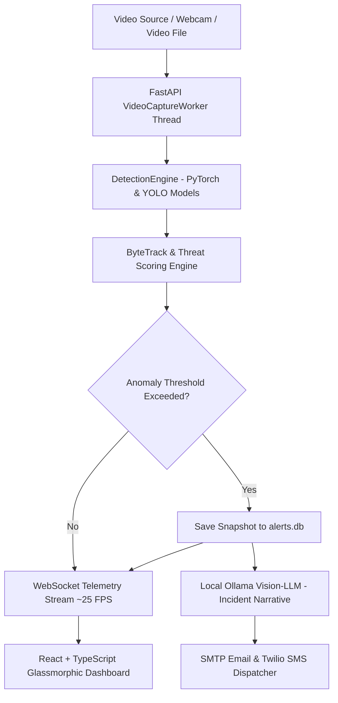

# 🛡️ Rakshak AI — Next-Gen Autonomous AI Surveillance & Threat Intelligence Platform

<p align="center">
  
</p>

<p align="center">
  <a href="https://fastapi.tiangolo.com/"></a>
  <a href="https://reactjs.org/"></a>
  <a href="https://www.typescriptlang.org/"></a>
  <a href="https://pytorch.org/"></a>
  <a href="https://docs.ultralytics.com/"></a>
  <a href="https://opencv.org/"></a>
  <a href="https://www.docker.com/"></a>
</p>

---

## 📋 Table of Contents

- [Overview](#-overview)
- [Key Features](#-key-features)
- [System Architecture](#-system-architecture)
- [Repository Structure](#-repository-structure)
- [Prerequisites](#-prerequisites)
- [Local Quickstart](#-local-quickstart)
  - [Backend Setup](#backend-setup)
  - [Frontend Setup](#frontend-setup)
- [Docker Deployment](#-docker-deployment)
- [Configuration Matrix](#-configuration-matrix)
- [AI Model Specifications](#-ai-model-specifications)
- [API & Telemetry Reference](#-api--telemetry-reference)
- [Detection Evaluation Suite](#-detection-evaluation-suite)
- [Verification & Build Commands](#-verification--build-commands)
- [License](#-license)

---

## 🎯 Overview

Traditional closed-circuit television (CCTV) infrastructure is predominantly **passive**: it records incidents for post-event forensic auditing while security operators suffer from cognitive fatigue monitoring dozens of screens. 

**Rakshak AI** transforms surveillance from passive recording to **autonomous, real-time threat intelligence and proactive dispatch**. Powered by a FastAPI backend, CUDA-accelerated YOLO detection pipelines, ByteTrack object tracking, localized Vision-LLM incident context enrichment (Ollama/Moondream2), and a responsive React dashboard, Rakshak AI detects hazards in milliseconds and alerts stakeholders instantly with snapshot evidence.

---

## ✨ Key Features

### 🔫 Multi-Threat AI Detection Matrix
- **Weapon Detection:** Identifies firearms, knives, and brandished weapons (`weapon.pt`) with NMS suppression.
- **Fire & Smoke Hazard:** Real-time structural fire and smoke detection (`fire.pt`) for immediate emergency response.
- **Fall & Medical Emergencies:** Identifies sudden slip-and-fall incidents (`fall_model.pt`) in public spaces or eldercare facilities.
- **Crowd Density Tracking:** Monitors human counts using YOLOv11/v8 (`yolo11n.pt`) to prevent stampedes or unauthorized gatherings.

### 🚧 Interactive Perimeter & Intrusion Control
- **Interactive Restricted Zone Drawing:** Draw custom polygon boundaries directly onto the live video canvas via SVG vector overlays.
- **Perspective-Safe Dual-Point Validation:** Evaluates both center-mass and feet-ground coordinates against drawn polygons to eliminate false perspective triggers.
- **Authorized Roster Bypass:** Exempts registered personnel from triggering trespass alerts using roster matching.

### 🧠 Scene Memory & Threat Engine
- **ByteTrack Tracking:** Multi-object tracking assigning persistent IDs across video frames.
- **Temporal Score Accumulation:** Mitigates momentary false positives by requiring sustained detection confidence across temporal windows before dispatching high-priority alerts.
- **Local Vision-LLM Context Enrichment:** Routes anomaly frames to a local Ollama Vision-LLM (`moondream`) to generate natural language incident summaries (e.g., *"Individual in dark clothing brandishing a weapon near Entrance B"*).

### ⚡ Live Telemetry & Instant Alert Routing
- **~25 FPS WebSocket Streaming:** Base64-encoded frame transmission and live metadata streaming over WebSocket connections.
- **Multi-Channel Alert Dispatch:** Automated SMTP email dispatch and Twilio SMS routing embedded with high-resolution JPEG evidence snapshots.
- **Historical Anomaly Replay:** Database-backed alert archive (`alerts.db`) allowing operators to review historical snapshots and video frames.

---

## ⚙️ System Architecture



---

## 📁 Repository Structure

```text
Rakshak/
├── backend/
│   ├── ai_core/                  # Core AI Engine
│   │   ├── advanced_ai/          # Audio, behavior, face recognition & edge modules
│   │   ├── agents/               # Multi-agent analysis orchestrator
│   │   ├── detectors/            # Specialized detectors (fall, fire, intrusion, weapon)
│   │   ├── llm/                  # Vision-LLM integration (Ollama)
│   │   ├── notifications/        # Alert formatting & email/SMS handlers
│   │   ├── scene_memory/         # State memory & Redis persistence
│   │   ├── temporal_validation/  # Temporal score smoothing
│   │   ├── threat_engine/        # Dynamic threat scoring matrix
│   │   ├── tracking/             # ByteTrack multi-object tracker & zone state
│   │   ├── model_service.py      # Model weightsloader
│   │   └── pipeline.py           # Unified inference pipeline wrapper
│   ├── ai_modules/               # Facade & perimeter engine compatibility layers
│   ├── eval/                     # Model evaluation script (evaluate_detection.py)
│   ├── models/                   # Pre-trained PyTorch/YOLO model weights (.pt)
│   │   ├── fall_model.pt
│   │   ├── fire.pt
│   │   ├── weapon.pt
│   │   └── yolo11n.pt
│   ├── services/                 # Notification services
│   ├── config.py                 # Pydantic & environment settings
│   ├── database.py               # SQLite alert storage engine
│   ├── main.py                   # FastAPI app routes & WebSocket handler
│   └── requirements.txt          # Python dependencies
├── frontend/
│   ├── src/
│   │   ├── assets/               # Branding assets & icons
│   │   ├── utils/                # Mock data & UI utility helpers
│   │   ├── views/                # Dashboard views (Analytics, AlertsSent, DetectionHistory)
│   │   ├── App.tsx               # Main operational interface
│   │   ├── main.tsx              # React entrypoint
│   │   └── index.css             # Tailwind CSS tokens
│   ├── package.json
│   ├── vite.config.ts
│   └── tailwind.config.js
├── Dockerfile                    # Multi-stage production container build
├── docker-compose.yml            # Full container orchestration with Redis
├── EXECUTIVE_PRESENTATION.md     # High-level product deck & roadmap
├── TECHNICAL_BLUEPRINT.md        # Technical architecture report
├── .env.example                  # Environment configuration template
└── README.md                     # Project documentation
```

---

## 🛠️ Prerequisites

- **Python:** 3.10 or higher
- **Node.js:** v20.x or higher
- **npm:** 9.x or higher
- **CUDA (Optional):** NVIDIA GPU with CUDA drivers installed for hardware acceleration.
- **Docker & Docker Compose (Optional):** For containerized deployment.
- **Ollama (Optional):** For local Vision-LLM incident enrichment (`ollama pull moondream`).

---

## 🚀 Local Quickstart

### 1. Clone & Prepare Environment

```bash
git clone https://github.com/Itsbhavesh1101/RakshakAI.git
cd RakshakAI
```

Create `.env` configuration file from template:

```bash
# On Linux / macOS
cp .env.example .env

# On Windows PowerShell
Copy-Item .env.example .env
```

---

### Backend Setup

1. Create and activate a Python virtual environment:

```bash
# On Linux / macOS
python3 -m venv backend/.venv
source backend/.venv/bin/activate

# On Windows PowerShell
python -m venv backend\.venv
backend\.venv\Scripts\Activate.ps1
```

2. Install Python dependencies:

```bash
pip install --upgrade pip
pip install -r backend/requirements.txt
```

3. Launch FastAPI Server:

```bash
python -m uvicorn main:app --app-dir backend --host 127.0.0.1 --port 8000 --reload
```

- **Health Check:** `http://localhost:8000/api/health`
- **Swagger OpenAPI Documentation:** `http://localhost:8000/docs`
- **WebSocket Endpoint:** `ws://localhost:8000/api/ws/telemetry`

---

### Frontend Setup

In a separate terminal window:

```bash
cd frontend
npm install
npm run dev
```

Open your browser at `http://localhost:5173`. The React application connects automatically to `http://localhost:8000`.

---

## 🐳 Docker Deployment

The production `Dockerfile` compiles the React frontend into static assets and serves them via FastAPI alongside backend AI processing in a single unified container. Redis is provisioned via Docker Compose for scene memory management.

```bash
# Build and start services in detached mode
docker compose up --build -d
```

- **Dashboard Interface:** `http://localhost:8000`
- **API Status:** `http://localhost:8000/api/health`

To view container logs:
```bash
docker compose logs -f rakshak-platform
```

To stop containers:
```bash
docker compose down
```

---

## ⚙️ Configuration Matrix

All runtime parameters are configured via environment variables in `.env` or adjusted live from the frontend settings panel:

| Category | Environment Variable | Default Value | Description |
| :--- | :--- | :--- | :--- |
| **Video Source** | `SOURCE_TYPE` | `webcam` | Input feed type: `webcam` or `file` |
| | `CAMERA_DEVICE_ID` | `0` | Camera device index for hardware capture |
| | `VIDEO_FILEPATH` | `""` | Absolute path to video file if `SOURCE_TYPE=file` |
| **Performance** | `TARGET_FPS` | `25` | Target capture rate |
| | `INFERENCE_FPS` | `10` | Frequency of neural network evaluation |
| | `MODEL_IMGSZ` | `640` | Input dimension resizing for YOLO inference |
| **Active AI Modules** | `ACTIVE_MODULES` | `weapon,fire,fall,intrusion,crowd` | Comma-separated active detection modules |
| **Model Weights** | `WEAPON_MODEL_FILE` | `weapon.pt` | Path relative to `backend/models/` |
| | `FIRE_MODEL_FILE` | `fire.pt` | Path relative to `backend/models/` |
| | `FALL_MODEL_FILE` | `fall_model.pt` | Path relative to `backend/models/` |
| | `PERSON_MODEL_FILE` | `yolo11n.pt` | Path relative to `backend/models/` |
| **Thresholds** | `CONFIDENCE_WEAPON` | `0.45` | Detection threshold for firearms & blades |
| | `CONFIDENCE_FIRE` | `0.45` | Detection threshold for fire & smoke |
| | `CONFIDENCE_FALL` | `0.45` | Detection threshold for slip-and-fall |
| **Ollama LLM** | `OLLAMA_BASE_URL` | `http://localhost:11434` | Endpoint URL for Ollama local Vision-LLM |
| | `OLLAMA_MODEL` | `moondream` | Ollama model tag for incident enrichment |
| **Notifications** | `SMTP_ENABLED` | `false` | Enable automated email alert dispatch |
| | `SMS_ENABLED` | `false` | Enable Twilio SMS alert dispatch |

---

## 🧠 AI Model Specifications

| Domain | Weight File | Target Classes | Default Confidence | Optimization & Suppression Strategy |
| :--- | :--- | :--- | :--- | :--- |
| **Weapons** | `weapon.pt` | `0: 'weapon'` | `0.45` | Substring match (`gun`, `pistol`, `knife`, `weapon`) with IoU suppression |
| **Fire & Smoke** | `fire.pt` | `0: 'Fire'`, `1: 'default'`, `2: 'smoke'` | `0.45` | Custom class alias mapping for rapid fire/smoke categorization |
| **Falls & Accidents**| `fall_model.pt` | `0: 'Fall-Detected'` | `0.45` | Broadened substring heuristic matching for posture anomalies |
| **People & Intrusion**| `yolo11n.pt` | `0: 'person'` | `0.40` | Dual-point ground contact evaluation against restricted polygon points |

---

## 📡 API & Telemetry Reference

### REST API Endpoints

- `GET /api/health` — System status, camera feed readiness, and CUDA availability.
- `GET /api/alerts` — Fetch historical detection events stored in SQLite.
- `POST /api/settings` — Update detection thresholds and active modules dynamically.
- `GET /api/snapshots/{filename}` — Retrieve snapshot image evidence for an anomaly.

### WebSocket Telemetry Contract (`/api/ws/telemetry`)

Each frame broadcast delivers JSON structured telemetry at ~25 FPS:

```json
{
  "frame": "data:image/jpeg;base64,...",
  "detections": [
    {
      "class_name": "weapon",
      "confidence": 0.89,
      "box": [120, 80, 240, 310],
      "id": 12
    }
  ],
  "threat_level": "CRITICAL",
  "threat_score": 85,
  "stats": {
    "fps": 24.8,
    "active_people": 4,
    "anomalies_detected": 1
  }
}
```

---

## 🧪 Detection Evaluation Suite

Rakshak includes an automated model evaluation script (`backend/eval/evaluate_detection.py`) to calculate precision, recall, and mAP metrics against custom datasets formatted in YOLO format.

### Dataset Directory Format

```text
dataset/
├── images/
│   ├── frame_0001.jpg
│   └── frame_0002.jpg
└── labels/
    ├── frame_0001.txt
    └── frame_0002.txt
```

### Execution Command

```bash
python backend/eval/evaluate_detection.py \
  --dataset /path/to/dataset \
  --output backend/eval/runs/baseline_run
```

Outputs include `metrics.json`, performance summaries, and false-positive / false-negative image crops for model verification.

---

## 🔍 Verification & Build Commands

Before pushing or deploying code, verify backend and frontend integrity:

### Backend Syntax Verification
```bash
python -m py_compile backend/main.py backend/database.py backend/config.py backend/ai_modules/detection_engine.py backend/ai_modules/perimeter_engine.py
```

### Frontend Type Check & Production Build
```bash
cd frontend
npm run lint
npm run build
```

---

## 📄 License

Distributed under the MIT License. See `LICENSE` for details.

<p align="center">
  <b>Rakshak AI — Empowering Safer Spaces Through Autonomous Vision Intelligence</b>
</p>
